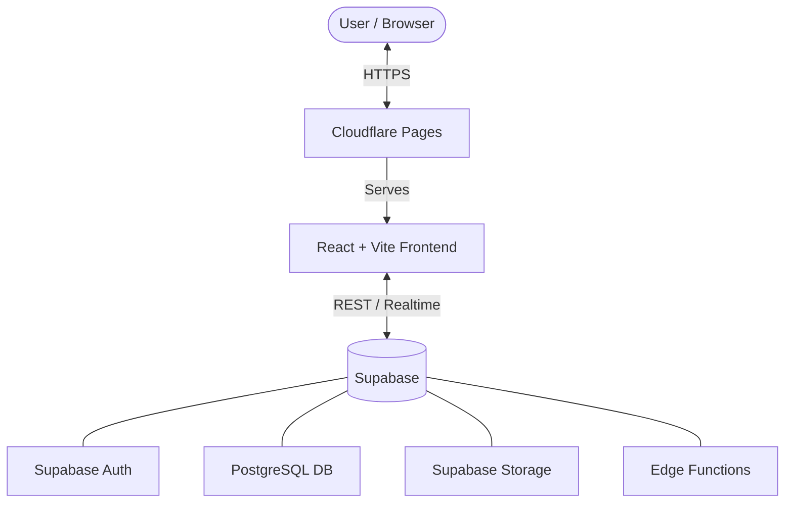
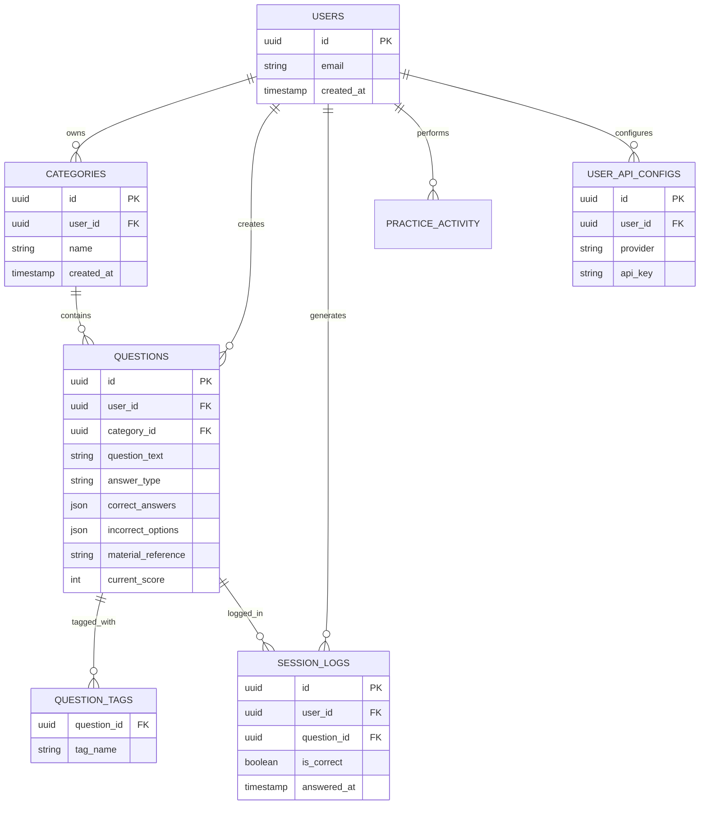
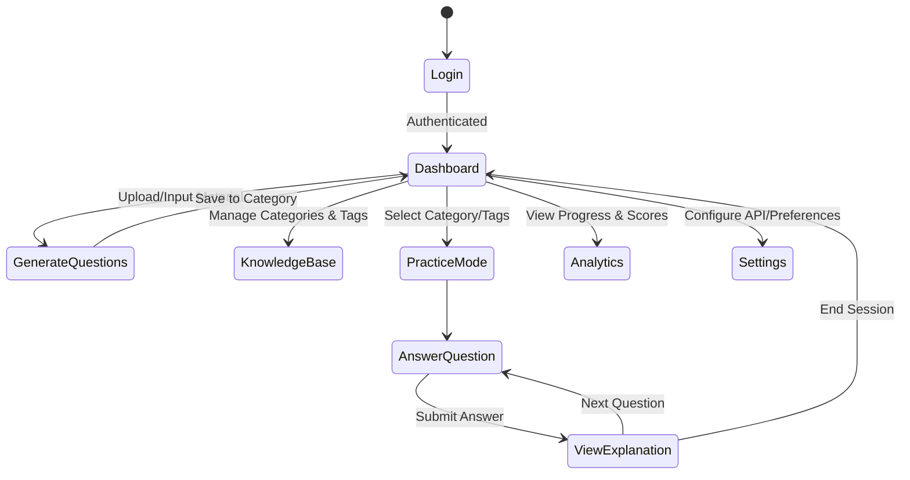

# QuizifAI 🧠✨

QuizifAI is an intelligent, AI-powered quiz generation and practice platform. It enables users to automatically generate quizzes from their study materials, categorize them, practice interactively, and track their performance over time through comprehensive analytics.

---

## 🏗️ Architecture & Infrastructure

The application leverages a modern, serverless architecture for high performance, scalability, and developer experience.



- **Frontend**: Built with React and Vite for a lightning-fast development experience and optimized production build.
- **Backend & Database**: Powered by Supabase (PostgreSQL), providing secure data storage, authentication, and edge functions.
- **Hosting**: Deployed on Cloudflare Pages, ensuring global CDN distribution and seamless CI/CD integration.

---

## 🗄️ Database Entity Relationship Diagram (ERD)



---

## 🔄 User Activity Diagram



---

## ✨ Detailed Features

- **🤖 AI-Powered Question Generation**: Automatically generate multiple-choice, short-answer, and checkbox questions from uploaded documents or text.
- **📚 Knowledge Base Management**: Organize questions into Categories and use Tags for granular filtering and organization.
- **📝 Interactive Practice Mode**: Take quizzes with real-time feedback, scoring, and AI-generated explanations for both correct and incorrect answers.
- **📈 Performance Analytics**: Track your learning progress over time with knowledge scores and session logs.
- **⚙️ Custom API Configurations**: Bring your own API keys (BYOK) for various AI providers to power the generation and explanation features.
- **🗑️ Soft Deletes & Recovery**: Accidental deletions can be recovered thanks to the robust data schema.
- **📄 Document Parsing**: Support for extracting text from PDFs and Word documents natively.

---

## 🛠️ Onboarding & Local Development

### Prerequisites
Make sure you have **Node.js (v18+)** and **npm** installed on your machine.

### Environment Variables
To run this project locally, you will need to set up a Supabase project and provide the following environment variables. Create a `.env` file in the root directory based on `.env.example`:

```env
VITE_SUPABASE_URL=https://your-project-id.supabase.co
VITE_SUPABASE_ANON_KEY=your-anon-key-here
```

### Installation

1. **Clone the repository:**
   ```bash
   git clone https://github.com/your-org/QuizifAI.git
   cd QuizifAI
   ```

2. **Install dependencies:**
   ```bash
   npm install
   ```

3. **Start the development server:**
   ```bash
   npm run dev
   ```
   The application will be available at `http://localhost:5173`.

### Key Libraries & Packages
- `react` & `react-dom` - Core frontend framework
- `vite` - Fast build tool and development server
- `react-router-dom` - Client-side application routing
- `@supabase/supabase-js` - Supabase client for database operations and authentication
- `lucide-react` - Beautiful, consistent iconography
- `mammoth` & `pdfjs-dist` - Document parsing for AI context extraction from word and pdf files
- `react-hot-toast` - Elegant toast notifications for user feedback
- `vitest` & `@testing-library/react` - Robust unit testing suite

---

## 📁 Project Structure

```text
QuizifAI/
├── public/               # Static assets
├── src/
│   ├── components/       # Reusable UI components
│   ├── pages/            # Page components (Dashboard, Practice, etc.)
│   ├── lib/              # Utility functions and configurations
│   ├── App.jsx           # Main application routing
│   └── main.jsx          # Entry point
├── supabase/
│   ├── functions/        # Supabase Edge Functions (e.g., generate-questions)
│   └── migrations/       # Database schema and RLS policies
├── package.json          # Dependencies and scripts
└── vite.config.js        # Vite configuration
```

---

## 🤝 Contributing

We welcome contributions from the community! If you'd like to help improve QuizifAI:
1. Fork the repository.
2. Create a feature branch (`git checkout -b feature/amazing-feature`).
3. Commit your changes (`git commit -m 'feat: add amazing feature'`).
4. Push to the branch (`git push origin feature/amazing-feature`).
5. Open a Pull Request.

Please ensure your code follows the existing style and all tests pass (`npm run test`).

## 📜 License

This project is licensed under the MIT License - see the LICENSE file for details.
