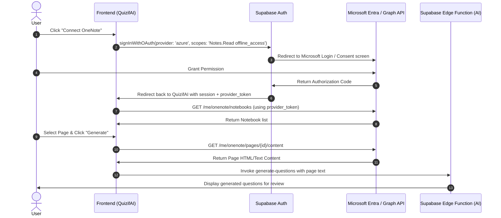

# Automating OneNote Integration with QuizifAI

This guide provides a step-by-step walkthrough to automate the creation of questions and answers directly from a user's **Microsoft OneNote** notebooks. 

By integrating the **Microsoft Graph API** with **Supabase OAuth**, users will be able to browse their notebooks, sections, and pages directly within QuizifAI, select a page, fetch its content, and automatically feed it into the AI question generator.

---

## How It Works (Data Flow)

The integration relies on Microsoft Graph OAuth 2.0 to access the user's notebooks securely.



---

## Step 1: Register an App in Microsoft Azure Portal

To query a user's OneNote, you need to register QuizifAI as an application in the Microsoft identity platform.

1. Go to the [Azure Portal - App Registrations](https://portal.azure.com/#view/Microsoft_AAD_RegisteredApps/ApplicationsListBlade).
2. Click **New registration**.
3. Fill in the registration details:
   - **Name**: `QuizifAI`
   - **Supported account types**: Select **Accounts in any organizational directory (Any Microsoft Entra ID tenant - Multitenant) and personal Microsoft accounts (e.g. Skype, Xbox)**.
   - **Redirect URI**: Select **Web** and enter your Supabase Auth callback URL:
     - *Local Dev:* `https://<your-project-ref>.supabase.co/auth/v1/callback`
4. Click **Register**.
5. Copy the **Application (client) ID** and **Directory (tenant) ID** from the Overview page.

### Configure client secret:
1. In the left menu of the registered app, go to **Certificates & secrets** > **Client secrets**.
2. Click **New client secret**.
3. Add a description (e.g. `QuizifAI Dev Client Secret`), choose an expiration, and click **Add**.
4. **IMPORTANT**: Copy the secret **Value** immediately (this value is hidden forever after you leave the page).

### Configure API Permissions:
1. Go to **API permissions** > **Add a permission**.
2. Choose **Microsoft Graph** > **Delegated permissions**.
3. Search for and select:
   - `Notes.Read` (Allows reading the user's OneNote notebooks, sections, and pages).
   - `offline_access` (Required to retrieve a refresh token so the user doesn't have to re-login every hour).
4. Click **Add permissions**.

---

## Step 2: Configure Supabase Microsoft Provider

Supabase handles the OAuth handshake and retrieves the access and refresh tokens for you.

1. Go to your **Supabase Dashboard** > **Authentication** > **Providers**.
2. Scroll down and expand **Azure (Microsoft)**.
3. Toggle **Enable Azure (Microsoft) provider**.
4. Enter the credentials from Step 1:
   - **Client ID**: Your Azure Application (client) ID.
   - **Client Secret**: The client secret value you generated.
   - **Tenant ID**: `common` (This allows both personal Microsoft accounts and business/school accounts to sign in).
5. Click **Save**.

---

## Step 3: Implement Microsoft OAuth Login in Frontend

To perform Graph API queries, the frontend must sign the user in using their Microsoft account so Supabase can acquire the necessary provider token.

Add a "Connect OneNote" button that triggers the OAuth flow:

```javascript
import { supabase } from '../lib/supabase';

export async function connectOneNote() {
  const { data, error } = await supabase.auth.signInWithOAuth({
    provider: 'azure',
    options: {
      // Notes.Read: Read OneNote pages
      // offline_access: Get refresh token to prevent 1-hour expiration logouts
      scopes: 'openid email profile Notes.Read offline_access',
      redirectTo: window.location.origin + '/generate',
    },
  });

  if (error) {
    console.error('Error connecting to OneNote:', error.message);
    throw error;
  }
}
```

When the user returns to the app, the Supabase session will contain the Microsoft Graph token:

```javascript
const session = await supabase.auth.getSession();
const microsoftAccessToken = session.data.session?.provider_token;
const microsoftRefreshToken = session.data.session?.provider_refresh_token;
```

---

## Step 4: Query Microsoft Graph API (Browse Notebooks & Pages)

Use the acquired `provider_token` to query the user's OneNote pages. Here are the core endpoints and a utility helper class to manage requests.

### Helper Service: `oneNoteService.js`
Create a new utility at `src/services/oneNoteService.js`:

```javascript
const GRAPH_BASE_URL = 'https://graph.microsoft.com/v1.0';

export class OneNoteService {
  constructor(accessToken) {
    this.accessToken = accessToken;
  }

  async fetchWithAuth(endpoint) {
    const response = await fetch(`${GRAPH_BASE_URL}${endpoint}`, {
      headers: {
        Authorization: `Bearer ${this.accessToken}`,
        Accept: 'application/json',
      },
    });

    if (!response.ok) {
      const errorText = await response.text();
      throw new Error(`Graph API error: ${response.status} - ${errorText}`);
    }

    return response.json();
  }

  // 1. Get all Notebooks
  async getNotebooks() {
    const data = await this.fetchWithAuth('/me/onenote/notebooks?$select=id,displayName');
    return data.value;
  }

  // 2. Get Sections within a Notebook
  async getSections(notebookId) {
    const data = await this.fetchWithAuth(`/me/onenote/notebooks/${notebookId}/sections?$select=id,displayName`);
    return data.value;
  }

  // 3. Get Pages within a Section
  async getPages(sectionId) {
    const data = await this.fetchWithAuth(`/me/onenote/sections/${sectionId}/pages?$select=id,title,lastModifiedDateTime`);
    return data.value;
  }

  // 4. Get HTML content of a page
  async getPageContent(pageId) {
    const response = await fetch(`${GRAPH_BASE_URL}/me/onenote/pages/${pageId}/content`, {
      headers: {
        Authorization: `Bearer ${this.accessToken}`,
      },
    });

    if (!response.ok) {
      throw new Error(`Failed to fetch page content: ${response.statusText}`);
    }

    // Graph API returns OneNote page content as raw HTML/MHTML
    const htmlContent = await response.text();
    return htmlContent;
  }
}
```

---

## Step 5: Clean Content & Generate Questions

OneNote pages return rich HTML. Before passing it to your Supabase Edge Function, it's best to strip HTML tags to reduce token usage and improve AI comprehension.

### 1. HTML Strip Helper
Create a helper function in your frontend:

```javascript
function extractTextFromHtml(htmlString) {
  const parser = new DOMParser();
  const doc = parser.parseFromString(htmlString, 'text/html');
  
  // Extract all text content, keeping line breaks clean
  return doc.body.innerText || doc.body.textContent || '';
}
```

### 2. Connect to useQuestions Hook
Modify `src/pages/GeneratePage.jsx` to support a new **"OneNote" mode**. When the user selects a page, trigger the generation flow:

```javascript
const handleGenerateFromOneNote = async (pageId) => {
  try {
    setGenerating(true);
    
    // 1. Get raw HTML from Graph API
    const htmlContent = await oneNoteService.getPageContent(pageId);
    
    // 2. Strip HTML to raw text
    const cleanText = extractTextFromHtml(htmlContent);
    
    if (!cleanText.trim()) {
      toast.error('The selected OneNote page is empty.');
      return;
    }
    
    // 3. Invoke your existing text-based generator function!
    await generateQuestions({
      text: cleanText,
      questionTypes: selectedTypes,
      count: questionCount,
      tags: tags,
    });
    
    // 4. Advance to the Review step
    setStep(2);
    toast.success('Questions generated successfully from OneNote page!');
  } catch (error) {
    toast.error(`OneNote generation failed: ${error.message}`);
  } finally {
    setGenerating(false);
  }
};
```

---

## Step 6: Handling Token Expiration (Crucial Edge Case)

Microsoft Graph Access Tokens expire after **1 hour**. 

Because Supabase Auth handles the initial sign-in, the access token stored in the user's session (`provider_token`) will stop working after 60 minutes. 

To prevent users from having to sign out and sign back in constantly, you can implement a token refresh mechanism. Since the frontend cannot directly request a refreshed token securely without exposing your Azure Client Secret, you should create a Supabase Edge Function (`refresh-provider-token`) to handle it:

### Supabase Edge Function to Refresh Azure Token
Create `supabase/functions/refresh-azure-token/index.ts`:

```typescript
import { serve } from "https://deno.land/std@0.168.0/http/server.ts";

serve(async (req) => {
  // 1. Extract the current user session/refresh token from request body
  const { refreshToken } = await req.json();

  if (!refreshToken) {
    return new Response(JSON.stringify({ error: "Missing refresh token" }), { status: 400 });
  }

  const clientId = Deno.env.get("AZURE_CLIENT_ID");
  const clientSecret = Deno.env.get("AZURE_CLIENT_SECRET");

  // 2. Query Microsoft Token Endpoint
  const response = await fetch("https://login.microsoftonline.com/common/oauth2/v2.0/token", {
    method: "POST",
    headers: {
      "Content-Type": "application/x-www-form-urlencoded",
    },
    body: new URLSearchParams({
      client_id: clientId || "",
      client_secret: clientSecret || "",
      grant_type: "refresh_token",
      refresh_token: refreshToken,
      scope: "Notes.Read offline_access",
    }),
  });

  const data = await response.json();
  
  if (!response.ok) {
    return new Response(JSON.stringify({ error: data }), { status: response.status });
  }

  // 3. Return the new access token and new refresh token to the frontend
  return new Response(
    JSON.stringify({
      accessToken: data.access_token,
      refreshToken: data.refresh_token, // Azure may rotate the refresh token
    }),
    { headers: { "Content-Type": "application/json" } }
  );
});
```

On the frontend, store the new access token in local state or update the session credentials as needed to keep the connection seamless.
