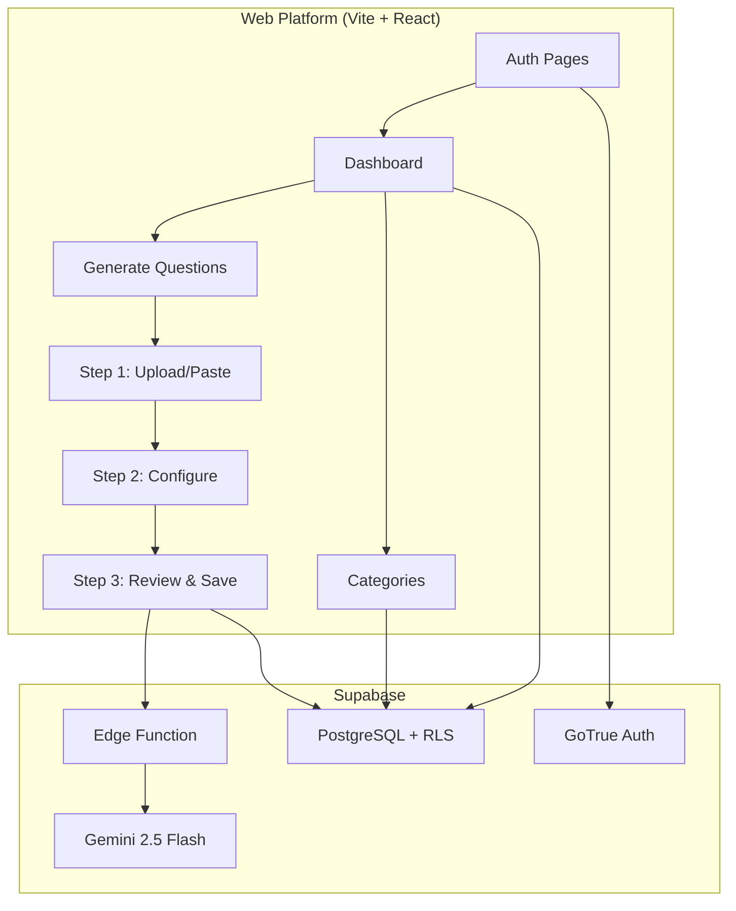

# QuizifAI Web Platform — Walkthrough

## Overview

Built a complete **Vite + React** web platform for QuizifAI — a companion to the Android quiz app. The web platform handles **uploading reference materials**, **AI-powered question generation** via Gemini 2.5 Flash, and **managing quiz content** (categories, tags, review/edit).

---

## Architecture



---

## Files Created

### Project Root
| File | Purpose |
|---|---|
| [package.json](file:///d:/C-related/Documents/GitHub/QuizifAI/package.json) | Vite 5 + React 18, all dependencies |
| [vite.config.js](file:///d:/C-related/Documents/GitHub/QuizifAI/vite.config.js) | Vite config with React plugin |
| [index.html](file:///d:/C-related/Documents/GitHub/QuizifAI/index.html) | SEO-optimized HTML entry |
| [.env.example](file:///d:/C-related/Documents/GitHub/QuizifAI/.env.example) | Template for Supabase env vars |

### Design System
| File | Purpose |
|---|---|
| [index.css](file:///d:/C-related/Documents/GitHub/QuizifAI/src/index.css) | 700+ lines of design tokens, components, and animations |

### Utility Libraries
| File | Purpose |
|---|---|
| [supabase.js](file:///d:/C-related/Documents/GitHub/QuizifAI/src/lib/supabase.js) | Supabase client with graceful fallback |
| [constants.js](file:///d:/C-related/Documents/GitHub/QuizifAI/src/lib/constants.js) | Question types, file limits, color mappings |
| [extractText.js](file:///d:/C-related/Documents/GitHub/QuizifAI/src/lib/extractText.js) | PDF/DOCX/MD text extraction |

### React Hooks
| File | Purpose |
|---|---|
| [useAuth.jsx](file:///d:/C-related/Documents/GitHub/QuizifAI/src/hooks/useAuth.jsx) | Auth context with session persistence |
| [useCategories.js](file:///d:/C-related/Documents/GitHub/QuizifAI/src/hooks/useCategories.js) | Category CRUD with question counts |
| [useQuestions.js](file:///d:/C-related/Documents/GitHub/QuizifAI/src/hooks/useQuestions.js) | Generate → review → save lifecycle |

### Components
| File | Purpose |
|---|---|
| [Navbar.jsx](file:///d:/C-related/Documents/GitHub/QuizifAI/src/components/Navbar.jsx) | Top nav with brand, links, user avatar |
| [ProtectedRoute.jsx](file:///d:/C-related/Documents/GitHub/QuizifAI/src/components/ProtectedRoute.jsx) | Auth guard with loading state |
| [FileUpload.jsx](file:///d:/C-related/Documents/GitHub/QuizifAI/src/components/FileUpload.jsx) | Drag-and-drop with extraction |
| [QuestionCard.jsx](file:///d:/C-related/Documents/GitHub/QuizifAI/src/components/QuestionCard.jsx) | Expandable inline-editing card |
| [CategoryCard.jsx](file:///d:/C-related/Documents/GitHub/QuizifAI/src/components/CategoryCard.jsx) | Card with edit/delete |
| [QuestionTypeSelector.jsx](file:///d:/C-related/Documents/GitHub/QuizifAI/src/components/QuestionTypeSelector.jsx) | Styled checkbox group |
| [TagInput.jsx](file:///d:/C-related/Documents/GitHub/QuizifAI/src/components/TagInput.jsx) | Chip-style tag input |
| [LoadingSpinner.jsx](file:///d:/C-related/Documents/GitHub/QuizifAI/src/components/LoadingSpinner.jsx) | Loading animation |
| [EmptyState.jsx](file:///d:/C-related/Documents/GitHub/QuizifAI/src/components/EmptyState.jsx) | Configurable empty state |

### Pages
| File | Purpose |
|---|---|
| [LoginPage.jsx](file:///d:/C-related/Documents/GitHub/QuizifAI/src/pages/LoginPage.jsx) | Email/password sign-in |
| [RegisterPage.jsx](file:///d:/C-related/Documents/GitHub/QuizifAI/src/pages/RegisterPage.jsx) | Sign-up with confirmation |
| [DashboardPage.jsx](file:///d:/C-related/Documents/GitHub/QuizifAI/src/pages/DashboardPage.jsx) | Stats, categories, recent activity |
| [GeneratePage.jsx](file:///d:/C-related/Documents/GitHub/QuizifAI/src/pages/GeneratePage.jsx) | 3-step generate flow |
| [CategoriesPage.jsx](file:///d:/C-related/Documents/GitHub/QuizifAI/src/pages/CategoriesPage.jsx) | Category CRUD grid |

### App Shell
| File | Purpose |
|---|---|
| [App.jsx](file:///d:/C-related/Documents/GitHub/QuizifAI/src/App.jsx) | Router + auth provider + toasts |
| [main.jsx](file:///d:/C-related/Documents/GitHub/QuizifAI/src/main.jsx) | React entry point |

### Supabase Backend
| File | Purpose |
|---|---|
| [001_initial_schema.sql](file:///d:/C-related/Documents/GitHub/QuizifAI/supabase/migrations/001_initial_schema.sql) | Full schema with RLS policies |
| [index.ts](file:///d:/C-related/Documents/GitHub/QuizifAI/supabase/functions/generate-questions/index.ts) | Gemini Edge Function |

---

## Design System Highlights

- **Theme**: Light mode with clean pastels — lavender primary (`#7C5CFC`), soft whites, mint greens, coral reds
- **Typography**: Google Fonts — `Outfit` for headings, `Inter` for body
- **Animations**: Slide-up entry animations with staggered delays, hover lifts, spring transitions
- **Components**: Buttons (5 variants), cards, badges, tag chips, upload zones, modals, skeleton loaders, step indicators

---

## Verification Results

| Check | Result |
|---|---|
| `npm run build` | ✅ 2070 modules transformed, built in 8.85s |
| `npm run dev` | ✅ Server started, login page renders correctly |
| Browser test | ✅ Login page displays with expected design |

---

## Next Steps to Deploy

1. **Create a Supabase project** at [supabase.com](https://supabase.com)
2. **Run the SQL migration**: Copy [001_initial_schema.sql](file:///d:/C-related/Documents/GitHub/QuizifAI/supabase/migrations/001_initial_schema.sql) into the Supabase SQL Editor and execute
3. **Deploy the Edge Function**:
   ```bash
   supabase functions deploy generate-questions
   supabase secrets set GEMINI_API_KEY=your-key-here
   ```
4. **Configure environment**: Copy `.env.example` → `.env` and fill in your Supabase URL + Anon Key
5. **Run locally**: `npm run dev`
6. **Deploy frontend**: Use Vercel, Netlify, or Cloudflare Pages
